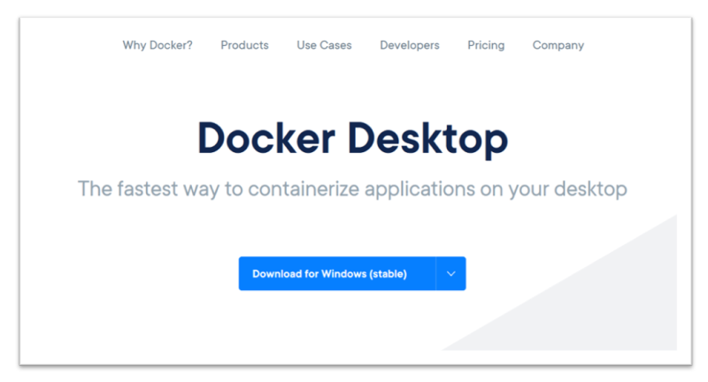

# Voorbereidingen Hands-On

In het tweede deel van de training besteden we aandacht aan het hands-on deel. Je kunt dat als demo gewoon mee kijken, maar leuker is het natuurlijk als je live mee doet! Om dat te kunnen, moet je wel de aantal voorbereidingen treffen. Volg hiervoor de volgende stappen uit: 

### Installatie van Docker Desktop
Installeer Docker Desktop op je laptop, daarmee krijg je alle tools voor zowel Docker als Kubernetes. De download voor Mac of Windows vind je hier: https://www.docker.com/products/docker-desktop

### Inschakelen van Kubernetes
Na de installatie van Docker Desktop is het inschakelen van Kubernetes slechts een kwestie van een checkbox. 

### Installatie van Visual Studio Code 
In de demo gebruik ik Visual Studio Code, maar je kunt natuurlijk zelf een andere editor gebruiken. Mocht je VS Code op Mac, Windows (of Linux) willen installeren, dan volg je de stappen hier: https://code.visualstudio.com/download 

### Installatie van de plugins (optioneel)
Visual Studio Code kent een plugin systeem, waarbij je via de Azure Marketplace functionaliteit kunt toevoegen. Je vindt de plugins in het linker menu binnen VS Code, het wijst zich eigenlijk vanzelf. Meer info over het plugin systeem via de Docs: https://code.visualstudio.com/docs/editor/extension-gallery

De volgende plugins zijn aan te raden:

### Installeren van de Azure CLI
Om Azure te kunnen beheren maak je gebruik van de Azure CLI. Volg de installatiestappen zoals hier beschreven: https://docs.microsoft.com/en-us/cli/azure/install-azure-cli

### Activeren van je Azure Credits (als je dit nog niet gedaan hebt)
Als je straks ook een Kubernetes Cluster in de cloud wilt kunnen gebruiken (naast je lokale Docker Desktop installatie), kun je via onze Azure Credits een eigen cluster aanmaken. 

- TODO

### Het aanmaken van een Kubernetes cluster 
Let op: volg het stappenplan!

- TODO

### Het registreren van de Kube Context

- TODO

### Clone van de repository

- TODO

### Uitvoeren van de smoketest

- TODO

### Optioneel: Installeer WSL2 op Windows (Windows Subsystem for Linux)
Wanneer je op Windows werkt is het raadzaam om WSL2 te installeren. Dit vraagt wel een bepaalde versie van Windows 10, maar als je de stappen in de documentatie volgt kom je er achter of je systeem geschikt is. Het is een optionele stap, maar WSL geeft je wel een fijne omgeving (en betere performance) als je straks verder gaat met het ontwikkelen op Kubernetes. 

https://docs.microsoft.com/en-us/windows/wsl/install-win10

Na de installatie van WSL2 kun je in Docker Desktop de integratie inschakelen.

Wanneer je ook de Azure CLI in WSL wil kunnen gebruiken, moet je daar de installatie nog uitvoeren. Dat staat ook hier beschreven: https://docs.microsoft.com/en-us/cli/azure/install-azure-cli

