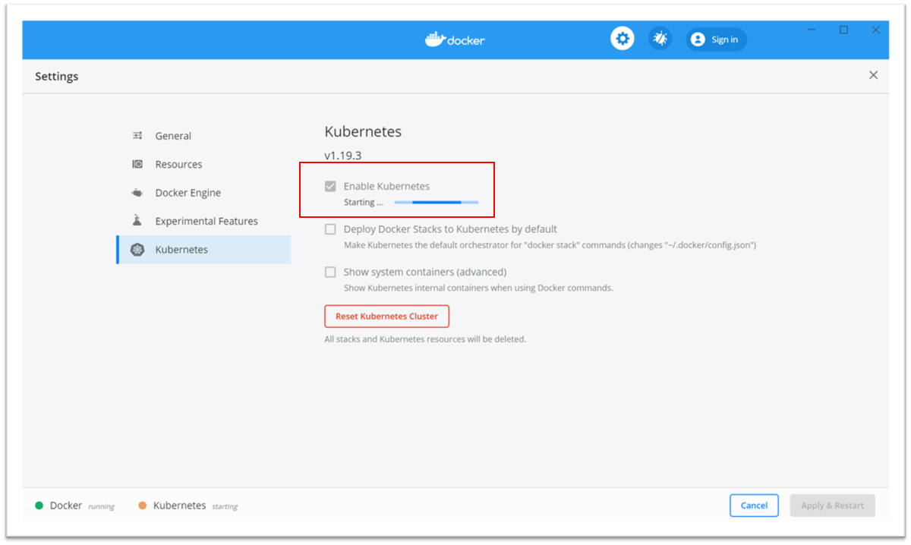

# Voorbereidingen Hands-On

In het tweede deel van de training besteden we aandacht aan het hands-on deel. Je kunt dat als demo gewoon mee kijken, maar leuker is het natuurlijk als je live mee doet! Om dat te kunnen, moet je wel een aantal voorbereidingen treffen. Volg hiervoor de volgende stappen uit: 

### Installatie van Docker Desktop
Installeer Docker Desktop op je laptop, daarmee krijg je alle tools voor zowel Docker als Kubernetes. De download voor Mac of Windows vind je hier: https://www.docker.com/products/docker-desktop


### Inschakelen van Kubernetes
Na de installatie van Docker Desktop is het inschakelen van Kubernetes slechts een kwestie van een checkbox (via de settings van Docker Desktop). 



### Installatie van Visual Studio Code 
In de demo gebruik ik Visual Studio Code, maar je kunt natuurlijk zelf een andere editor gebruiken. Mocht je VS Code op Mac of Windows willen installeren, dan volg je de stappen hier: https://code.visualstudio.com/download 

### Installatie van de plugins (optioneel)
Visual Studio Code kent een plugin systeem, waarbij je via de Azure Marketplace functionaliteit kunt toevoegen. Je vindt de plugins in het linker menu binnen VS Code, het wijst zich eigenlijk vanzelf. Meer info over het plugin systeem via de Docs: https://code.visualstudio.com/docs/editor/extension-gallery

De volgende plugins zijn aan te raden:


### Clone van de repository

Maak lokaal een clone van de git repo, dan heb je de demo bestanden bij de hand:

```
git clone https://github.com/VXCompany/Kubernetes-Ramp-Up
```

### Uitvoeren van de smoketest
Voer de volgende bash/commandline commando's uit om te zien of het lokale cluster goed werkt:

```
docker version #retourneert docker versie en status informatie
kubectl version #retourneert kubectl client en server versie informatie
kubectl get pods #retourneert na nieuwe installatie "No resources found in default namespace." 
kubectl get node #retourneert iets in de trant van "docker-desktop   Ready    master   36d   v1.16.6-beta.0"
```

### De demo apps
Er staan drie demo apps in de "training" folder. In de demo tijdens de studiemiddag maak ik gebruik van de Node.js app, maar je bent vrij om straks 1 van de andere apps te gebruiken. De stappen zijn straks voor deze apps vergelijkbaar.

### Optioneel: Installeer WSL2 op Windows (Windows Subsystem for Linux)
Wanneer je op Windows werkt is het raadzaam om WSL2 te installeren. Dit vraagt wel een bepaalde versie van Windows 10, maar als je de stappen in de documentatie volgt kom je er achter of je systeem geschikt is. Het is een optionele stap, maar WSL geeft je wel een fijne omgeving (en betere performance) als je straks verder gaat met het ontwikkelen op Kubernetes. 

https://docs.microsoft.com/en-us/windows/wsl/install-win10

Na de installatie van WSL2 kun je in Docker Desktop de integratie inschakelen (wederom via de Docker Desktop settings).


## Extra: Kubernetes in de cloud (optioneel)

Bovenstaande is wat je nodig hebt om lokaal met Kubernetes te werken. Wil je ook een Kubernetes cluster in de cloud gebruiken om deze (en volgende) trainingen te doen, dan kun je het beste de volgende stappen ook nog even meepakken:

### Activeren van je Azure Credits
Als je straks ook een Kubernetes cluster in de cloud wilt kunnen gebruiken (naast je lokale Docker Desktop installatie), kun je via onze Azure Credits een eigen cluster aanmaken. Als je dit nog niet gedaan hebt, kun je het activeren met je @vxcompany.com account via https://my.visualstudio.com 


### Installeren van de Azure CLI
Om Azure te kunnen beheren maak je gebruik van de Azure CLI. Volg de installatiestappen zoals hier beschreven: https://docs.microsoft.com/en-us/cli/azure/install-azure-cli

Tip: Wanneer je de Azure CLI ook in WSL2 wil kunnen gebruiken, moet je daar de installatie nogmaals uitvoeren. 

### Het aanmaken van een Kubernetes cluster 
Je kunt voor een Azure Kubernetes Service cluster de stappen uit de "Getting Started" volgen: https://docs.microsoft.com/nl-nl/azure/aks/kubernetes-walkthrough-portal#create-an-aks-cluster

Let er even op, dat je de juiste Resource Group (en locatie) kiest en dat je maximaal 1 node gebruikt. Wanneer je meer nodes kiest, dan is het maandelijkse budget aan Azure Credits niet voldoende.

### Verbinden met het cluster
Omdat je lokaal een Azure CLI geinstalleerd hebt, kun je met de volgende commandos verbinden met het Azure AKS cluster:
```
az login
az aks get-credentials --resource-group mijnAzureResourceGroup --name mijnAKSCluster
```

